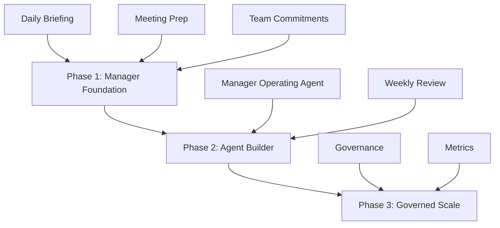

# Copilot Chief of Staff for Managers

Turn Microsoft 365 Copilot into a daily chief of staff for managers.

An open-source playbook that helps people managers, project managers, and functional leaders use Microsoft 365 Copilot to prepare, prioritize, follow through, and scale their impact.

⭐ If this saves you time, please star the repository.

---

## Why this exists

Every executive gets leverage.

Most managers don't.

This repository shows how to use Microsoft 365 Copilot as a lightweight digital chief of staff that helps managers:

- Start the day with clear priorities
- Prepare for important meetings
- Track commitments and follow-ups
- Protect focus time
- Review team execution
- Scale without adding overhead

[](LICENSE)
[](docs/00-overview.md)
[](docs/microsoft-references.md)

> Status: public playbook draft  
> Audience: people managers, functional leaders, project managers, program managers, chiefs of staff, enablement teams, and Microsoft 365 Copilot champions  
> Scope: Microsoft 365 Copilot, Copilot Chat, Outlook, Teams, meeting context, SharePoint, OneDrive, Agent Builder, and selective Copilot Studio escalation

## Start Here

New to the project?

1. Read the overview
2. Run the Daily Manager Briefing
3. Use the Meeting Prep Brief
4. Create the Manager Operating Agent
5. Scale with governance

## The 3-phase deployment model

| Phase | Goal | What you deploy | What you avoid |
|---|---|---|---|
| Phase 1: Manager Foundation | Prove value with manual prompts | Daily Manager Briefing, Meeting Prep, Team Commitments Review | No automation, no custom agents required |
| Phase 2: Agent Builder and Reusable Cadence | Convert stable prompts into a reusable Manager Operating Agent | Agent Builder instructions, starter prompts, selected knowledge sources, Weekly Review | Do not schedule noisy or speculative prompts |
| Phase 3: Governed Scale and Controlled Execution | Scale safely across teams | Department rollout, governance review, success metrics, selective Copilot Studio use | Do not create action-taking agents without approval gates |



## Quick start

1. Start with [`docs/00-overview.md`](docs/00-overview.md).
2. Pick a manager pilot group of 8 to 10 managers.
3. Run Phase 1 manually using the prompts in [`prompts/`](prompts/).
4. If the prompts create consistent value, build the reusable agent using [`agents/manager-operating-agent/`](agents/manager-operating-agent/).
5. Use [`docs/04-governance-and-safety.md`](docs/04-governance-and-safety.md) before scaling or adding execution.

## Recommended first prompt

```text
Act as my manager chief-of-staff. Review Microsoft 365 context available to Copilot from the last 24 hours: Outlook, Teams, calendar, meetings, transcripts, and relevant files.

Return these sections:
1. Today's top priorities
2. Decisions I need to make
3. People waiting on me
4. Meetings that need prep
5. Team commitments and blockers
6. Risks or weak signals, evidence-backed only
7. One recommended focus block

Rules: Keep it concise. Do not include low-value noise. Do not infer motives or emotions. Mark missing context clearly. Do not take action without approval.
```

## Manager persona examples

| Persona | Main pain | Best starting workflow | Success metric |
|---|---|---|---|
| People manager | Too many 1:1s, follow-ups, and team commitments | Daily Manager Briefing + 1:1 Prep + Team Commitments Review | Fewer missed commitments and better 1:1 continuity |
| Project manager | Cross-team dependencies, unclear owners, delivery risk | Team Commitments Review + Delivery Risk Watchlist + Weekly Manager Review | Earlier blocker detection and clearer owner follow-up |
| Functional leader | Stakeholder load, planning pressure, team-wide execution | Daily Manager Briefing + Stakeholder Radar + Weekly Review | Better weekly priority alignment and fewer unresolved asks |

See [`docs/07-manager-personas.md`](docs/07-manager-personas.md) for the full examples.

## Design principles

- Start read-only.
- Use prompts before agents.
- Use Agent Builder before Copilot Studio.
- Treat email as a signal source, not the operating system.
- Never infer employee motives, emotion, personality, or performance quality.
- Require explicit approval before any action that sends, deletes, schedules, routes, creates tasks, or modifies records.

## Disclaimer

This is a community playbook. It is not official Microsoft documentation, legal advice, compliance advice, or HR guidance. Always validate against your tenant settings, Microsoft documentation, internal policies, and legal or compliance requirements.

## License

Released under the MIT License. See [`LICENSE`](LICENSE).
